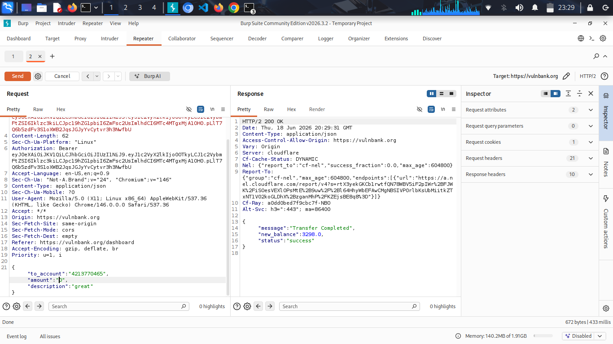

# Finding 02 – Improper Validation of Transaction Amount Allows Invalid Financial Operations

## Summary

The VulnBank application allows users to submit invalid transaction amounts such as negative values, zero, and decimal inputs. These values are processed as valid transactions, resulting in incorrect account balance updates. This indicates a failure in enforcing proper server-side validation and financial transaction rules.

## Affected Endpoint

`POST /transfer`

## Description

The application does not properly validate the `amount` parameter in transfer requests. The backend accepts and processes:

- Negative values (e.g. `-800`)
- Zero values (e.g. `0`)
- Decimal values (e.g. `0.01`)

Instead of rejecting invalid inputs, the system processes them as successful transactions and updates the account balance accordingly.

## Steps to Reproduce

1. Log in to the VulnBank application using valid credentials.
2. Intercept the request using Burp Suite.
3. Send a POST request to:
4. Modify the request body to test different values.


### Test 1 – Negative amount

```json
{
  "to_account": "4213770465",
  "amount": "-800",
  "description": "great"
}
```


### Test 2 – Zero amount

```json
{
  "to_account": "4213770465",
  "amount": "0",
  "description": "great"
}
```


### Test 3 – Decimal amount

```json
{
  "to_account": "4213770465",
  "amount": "0.01",
  "description": "great"
}
```


## Observation

All requests were processed successfully by the server without validation errors. The application accepts negative, zero, and decimal values as valid transaction amounts.

After each request, refreshing the account dashboard confirmed that the balance was updated accordingly.

## Evidence
  #### negative-amount
 

  #### zero-amount


  #### decimal-amount


  #### balance-after-transfer


## Impact

This vulnerability allows attackers to manipulate financial transactions by submitting invalid input values. This can lead to:

- Incorrect account balance updates  
- Financial integrity breakdown  
- Potential exploitation when combined with repeated requests or automation  
- Loss of trust in transaction processing logic  

In real-world banking systems, this could result in serious financial fraud or system abuse.

## Recommendation

- Enforce strict server-side validation for `amount`
- Ensure amount must be a positive number greater than zero
- Reject zero and negative values
- Prevent decimal values if not supported by business rules
- Ensure transaction logic cannot be influenced by client-side input manipulation
- Implement proper financial rules validation on the backend
- Log and monitor invalid transaction attempts

## Lessons Learned

- Business logic flaws can be more impactful than traditional injection vulnerabilities  
- Input validation must always be enforced on the server side  
- Financial systems require strict control over arithmetic operations  
- Even simple parameter manipulation can lead to significant system abuse if not properly validated  

## Notes

This issue demonstrates a weakness in how transaction rules are enforced rather than a traditional security vulnerability. It highlights the importance of validating business rules, not just input format.